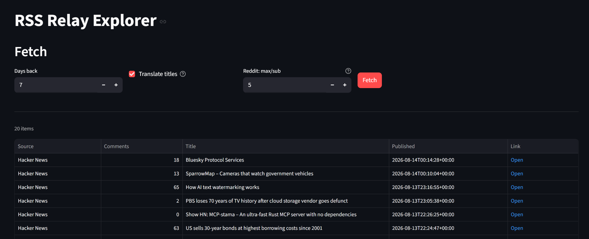

# RSS Relay Explorer

Pulls the newest posts from Hacker News, Reddit, and Lemmy into a single sortable table, with optional machine translation of titles. A single-process [Streamlit](https://streamlit.io/) app — runs locally, no cloud service, no account of any kind required to fetch content.

## Project scope

This started as a personal tool and is scoped as one. It intentionally does **not** try to match feature-rich alternatives like [Upvote RSS](https://github.com/johnwarne/upvote-rss) (article-body extraction, embedded images/galleries, AI summaries, a Reddit-like UI). Those are all things that *could* be added, but there's no plan to do so, and no ongoing feature-development roadmap — this repo gets fixes when something breaks, not regular feature updates. If you want a richer reading experience, Upvote RSS (or a proper feed reader) is a better fit than trying to grow this tool into one. What this tool is actually for: getting HN/Reddit/Lemmy's newest posts, with optional translation, without needing a Reddit API key.

## No ads

As long as content is pulled through RSS, promoted/sponsored posts should not appear. Reddit's "Promoted Posts" are inserted by an ad-auction system tied to its web/app feed-rendering pipeline — the ad isn't a property of the subreddit itself, it's targeted and injected at serve time for a specific viewer/session. A plain per-subreddit `.rss` pull requests that subreddit's own post list and isn't part of that ad-serving pipeline, so there shouldn't be anything for it to inject into. This wasn't independently confirmed against Reddit's own documentation (nothing conclusive was found either way), but it matches what was actually observed: across the 100+ real items pulled while building this tool (see `DESIGN_HISTORY.md` "M5"), none looked like sponsored content. Same reasoning applies to Hacker News and Lemmy — neither platform runs post-level ad auctions to begin with.

## No Reddit API key needed

This tool does **not** use Reddit's official API and does not require a Reddit account, an OAuth app registration, or a `REDDIT_CLIENT_ID`/`REDDIT_CLIENT_SECRET`.

That matters more than it used to: as of mid-2026, Reddit's official API access is gated behind a manual approval process under its "Responsible Builder Policy" — self-service app creation is closed, and approval requests commonly take weeks or go unanswered entirely, even for personal, low-volume use. Tools that require a registered Reddit app (e.g. to embed post media/galleries) are effectively unusable for anyone who can't get through that queue.

Instead, this tool uses Reddit's public, unauthenticated `.rss` endpoint. That endpoint has its own problem — Reddit rate-limits it hard by IP (independent of which subreddit you ask for; roughly one successful request per 45–60 seconds was measured). The workaround here: instead of one request per subscribed subreddit, all subscribed subreddits are combined into a **single** request (`r/sub1+sub2+.../hot/.rss?limit=100`), sorted by `hot` rather than `new` (which, empirically, spreads results across subreddits far more evenly — `new` let one high-volume subreddit fill the whole result window; `hot` didn't). See `DESIGN_NOTES.md` §2.1 and `DESIGN_HISTORY.md` "M5" for the measurements behind this design.

The trade-off: no Reddit comment counts are available this way (the unauthenticated feed doesn't expose them at all), and there's a small chance of missing very-low-traffic subreddits in the shared 100-item window. Hacker News (via `hnrss.org`) and Lemmy (each instance's own `/feeds/c/{community}.xml`) don't have either of these problems — comment counts are parsed directly from their feed descriptions.

## Features

- Combines Hacker News, Reddit, and Lemmy into one table: source, comment count (where available), title, published date, link.
- Comment counts for HN and Lemmy, parsed from each feed's own description field. Not available for Reddit (see above) — Reddit's `hot` sort is used as a practical stand-in for "is this thread currently active" instead.
- Links point to the actual comment-capable thread. (HN's raw feed link points at the linked article, not the HN discussion page — this tool corrects that so you land somewhere you can actually reply.)
- Optional title translation via [DeepL](https://www.deepl.com/pro-api). Can be turned off entirely — the tool runs with zero DeepL usage if you don't want or need translation.
- Adjustable per-subreddit result cap on the combined Reddit feed (keeps one very active subreddit from crowding out quieter ones, and bounds translation cost).
- Feed list is a plain CSV (`data/rss_feeds.csv`) — add, remove, or re-categorize sources without touching code.

## Setup

1. `pip install -r requirements.txt`
2. `streamlit run app.py`

That's it if you don't want translation. For translation, see below.

## Translation is optional

The "Translate titles" checkbox in the UI defaults to **on** only if a DeepL key is configured; otherwise it defaults to **off**, and the tool runs without ever contacting DeepL. You can flip it either way at fetch time regardless of the default.

To enable translation:

1. Copy `.env.example` to `.env`.
2. Get a DeepL API key at https://www.deepl.com/pro-api. Free-tier keys end in `:fx` and are picked up automatically (no extra config needed).
3. Set `DEEPL_TOKEN` in `.env`. Optionally set `RSS_TARGET_LANG` (defaults to `JA`; any DeepL `target_lang` code works, e.g. `EN`, `DE`, `FR`).

**Does the free tier cover it?** DeepL's free tier is 500,000 characters/month. This tool only translates item *titles*, never article bodies. Measured on a real run with default settings (Hacker News + Lemmy + the combined Reddit feed capped at 5 items/subreddit, ~130 items total, average title length ~50 characters): roughly **6,500 characters per fetch**. That's comfortably under the free tier for occasional or daily manual fetches (~500,000 / 6,500 ≈ 77 fetches/month). It is **not** enough headroom for high-frequency automated polling (e.g. hourly fetches would need ~4.7M characters/month, well past the free quota) — keep an eye on your DeepL usage dashboard if you automate this.

## Feed configuration (`data/rss_feeds.csv`)

Columns: `platform` (`hn` / `reddit` / `lemmy`), `label` (display name), `url`, `category` (free-text, currently unused by the code — reserved for a possible future topic-matching layer).

- **hn** / **lemmy**: one row per feed, `url` is that feed's own RSS/Atom URL.
- **reddit**: one row *per subreddit* for `label`/`category` bookkeeping, but all Reddit rows are expected to share the **same** `url` — the combined multi-subreddit `hot` feed described above. The code groups rows by `url` and fetches each unique URL once, then re-attaches the correct subreddit label to each result by parsing it out of the item's link. If you add a subreddit, add it to both the URL's `+`-joined subreddit list and as its own CSV row (for the label/category).

## Known limitations

- Reddit comment counts are unavailable (see above).
- The combined Reddit feed's 100-item window is shared across however many subreddits you subscribe to; very low-traffic subreddits may occasionally get squeezed out of a given run even though the `hot` sort measurably reduces this compared to `new` or `top`.
- Lemmy and Reddit community/subreddit activity levels vary enormously (subscriber counts spanning three orders of magnitude were observed across candidate communities during setup) — pick sources with comparable activity levels if you want roughly even coverage across topics; nothing in the code balances this for you automatically.
- `rss_feeds.csv`'s `category` column isn't consumed by any code yet; it's there for a possible future topic-matching layer that hasn't been built.

## More detail

- `DESIGN_NOTES.md` — current design of the fetch pipeline, per-platform quirks, storage schema (Japanese).
- `DESIGN_HISTORY.md` — chronological record of design changes, bugs found, and the reasoning behind them, including the Reddit rate-limiting investigation (Japanese).

## License

[MIT License](LICENSE)
